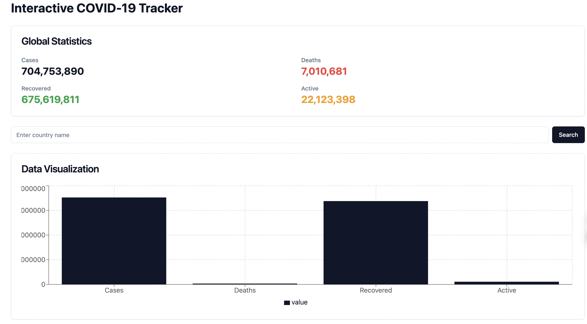
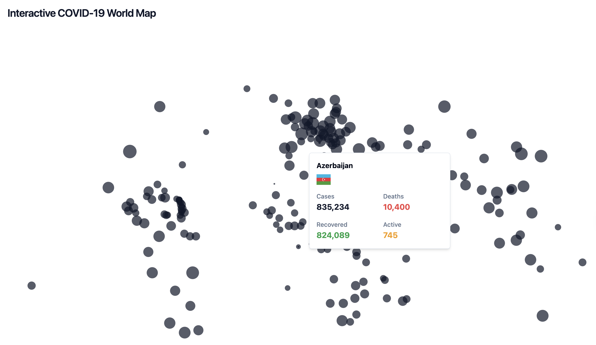

# COVID-19 Tracker

## Description
COVID-19 Tracker is a web application built using **React** and **TypeScript** that provides real-time global and country-specific statistics on COVID-19 cases, deaths, recoveries, and active cases. It features an interactive world map that allows users to hover over countries and view detailed statistics for each nation. The app uses the **disease.sh API** for real-time data and is styled with **TailwindCSS**.

## Features
- **Interactive World Map**: Hover over countries to view COVID-19 statistics.
- **Real-Time Data**: Fetches live data from the disease.sh API.
- **Country Search**: Quickly search for any country to view its COVID-19 stats.
- **Responsive Design**: Designed to work well on mobile, tablet, and desktop devices.
- **React Simple Maps**: Provides an easy way to integrate maps into your React project.

## Demo


## Tech Stack

| Technology | Badge |
|------------|-------|
| React      |  |
| TypeScript |  |
| TailwindCSS |  |
| Axios      |  |
| D3.js      |  |
| Radix UI   |  |
| Disease.sh API |  |


## Prerequisites
Before running the project, make sure you have the following installed:
- **Node.js** (version 14 or later)
- npm (Node Package Manager) or Yarn

## Getting Started

### 1. Clone the repository:
```bash
git clone https://github.com/your-username/covid-tracker.git
cd covid-tracker
```

### 2. Install the Dependencies

```
# Using npm
npm install

# Using yarn
yarn install
```

### 3. Run the Application

```
npm start
```
The app will be accessible at http://localhost:3000

### 4. Build for production
```
npm run build
```

## Usage

#### Map Interaction

- Hover over a country to display the number of cases, deaths, recoveries, and active COVID-19 cases in that country.
- Use the search functionality to quickly access data for a specific country.
- The map dynamically updates based on real-time COVID-19 statistics.




### Customization

- Map Data: If needed, you can replace the GeoJSON file used for the map by modifying the geoUrl in the code.
- API: The app fetches data from the disease.sh API. You can replace this with another API if needed by updating the relevant Axios requests in the code.

## API Reference
The app uses the disease.sh API to fetch real-time COVID-19 data:


| Type | Parameter     | 
| :-------- | :------- | 
| Global Data: | (https://disease.sh/v3/covid-19/all) | 
| Country Data | (https://disease.sh/v3/covid-19/countries) |


